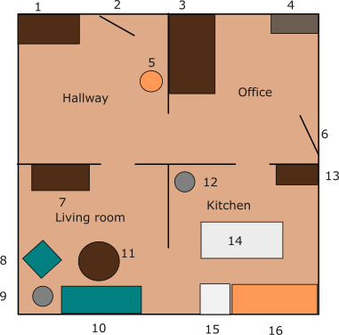
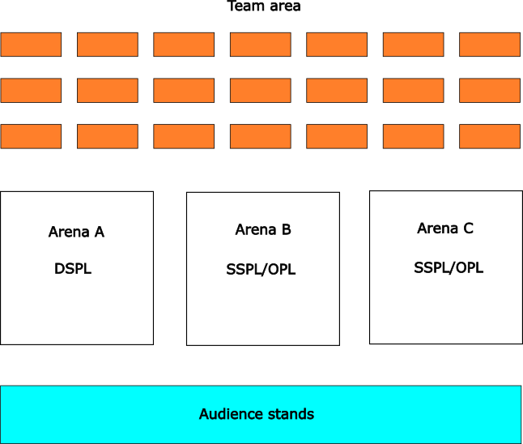
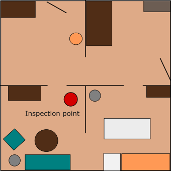
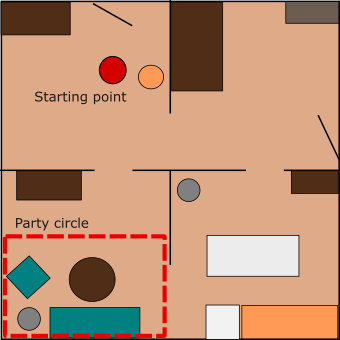
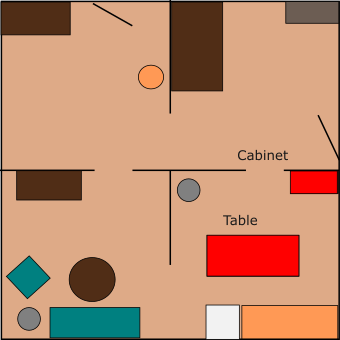
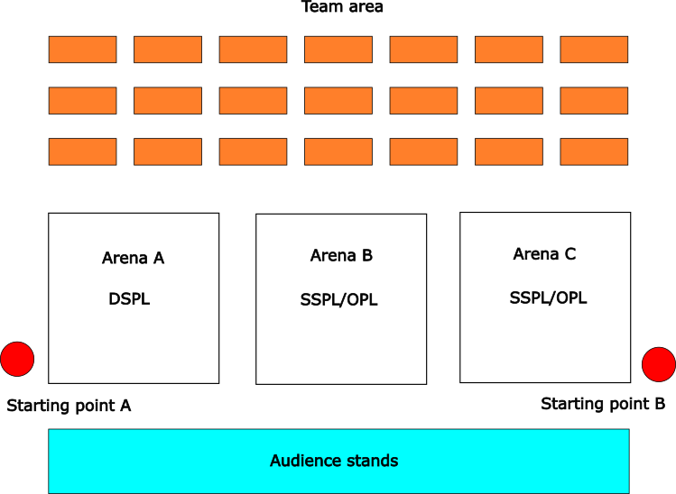
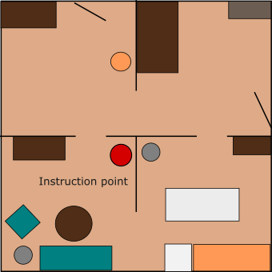
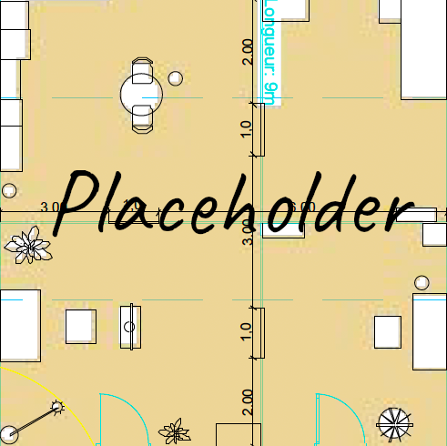
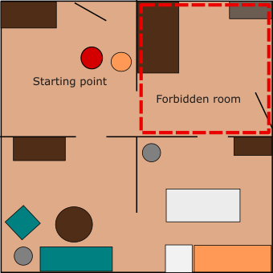

# Eindhoven2024

Join the Eindhoven 2024 Telegram group for quick announcements: https://t.me/+_BQlsF5p6LQ0MzZh

## Table of Contents

- [Scores](#scores)
- [Schedule](#schedule)
- [Arenas](#arenas)
- [Stage 1](#stage-1)
    + [Receptionist](#receptionist)
    + [Storing Groceries](#storing-groceries)
    + [Carry my Luggage](#carry-my-luggage)
    + [Serve Breakfast](#serve-breakfast)
    + [GPSR](#gpsr)
- [Stage 2](#stage-2)
    + [Clean the Table](#clean-the-table)
    + [Stickler for the Rules](#stickler-for-the-rules)
    + [EGPSR](#egpsr)

## Scores
<!--
Team rankings and total scores from stage 1 and stage 2

OPL

|     | Team Name (ranking) | Total scores (stage 1 and 2) |
| --- | ------------------- | ---------------------------- |
| 1   |                     |                              |
| 2   |                     |                              |
| 3   |                     |                              |
| 4   |                     |                              |
| 5   |                     |                              |
| 6   |                     |                              |
| 7   |                     |                              |
| 8   |                     |                              |
| 9   |                     |                              |
| 10  |                     |                              |
| 11  |                     |                              |
| 12  |                     |                              |
| 13  |                     |                              |
| 14  |                     |                              |
| 15  |                     |                              |

DSPL

|     | Team name (ranking) | Total score (stage 1 and 2) |
| --- | ------------------- | --------------------------- |
| 1   |                     |                             |
| 2   |                     |                             |
| 3   |                     |                             |
| 4   |                     |                             |
| 5   |                     |                             |
| 6   |                     |                             |
| 7   |                     |                             |
| 8   |                     |                             |
| 9   |                     |                             |
| 10  |                     |                             |
| 11  |                     |                             |

SSPL

|     | Team name (ranking) | Stage 1 + 2 points |
| --- | ------------------- | ------------------ |
| 1   |                     |                    |
| 2   |                     |                    |
| 3   |                     |                    |
| 4   |                     |                    |
-->

## Schedule

|       | Tue July 16         | Wed July 17         | Thu July 18         | Fri July 19               | Sat July 20                         | Sun July 21    |
| ----- | ------------------- |-------------------- | ------------------- | ------------------------- | ----------------------------------- | -------------- |
| 09:00 |                     |                     |                     | Serve Breakfast           | Restaurant (all teams present 8:30) |                |
| 10:00 |  Testslot #1        | Testslot #4         | Carry my Luggage    | Serve Breakfast           | Restaurant                          | Open challenge |
| 11:00 |  Testslot #1        | Testslot #4         | Carry my Luggage    |                           | Restaurant                          |                |
| 12:00 |                     |                     |                     | GPSR                      |                                     | Final          |
| 13:00 |  Testslot #2        |                     | Receptionist        | GPSR                      | Stickler for the Rules              | Final          |
| 14:00 |  Testslot #2        |                     | Receptionist        | announcement second stage | Stickler for the Rules              |                |
| 15:00 |                     | Opening Ceremony    |                     |                           |                                     |                |
| 16:00 |                     |                     | Storing Groceries   | Clean the Table           | EGPSR                               |                |
| 17:00 |  Testslot #3        | Robot Inspection    | Storing Groceries   | Clean the Table           | EGPSR                               |                |
| 18:00 |  Testslot #3        |                     |                     |                           |                                     |                |
| 19:00 | Team-Leader Meeting | Team-Leader Meeting | Team-Leader Meeting | Team-Leader Meeting       |                                     |                |
| 20:00 |                     | Poster Reception    |                     |                           |                                     |                |
### Testslots & Robot Inspection

#### Arena A (DSPL)

|#|Testslot#1 (Arena A), 7/16/24 10:00|League|#|Testslot#2 (Arena A), 7/16/24 13:00|League|#|Testslot#3 (Arena A), 7/16/24 17:00|League|#|Testslot#4 (Arena A), 7/17/24 10:00|League|#|Robot Inspection (Arena A), 7/17/24 16:00|League|
|-|-|-|-|-|-|-|-|-|-|-|-|-|-|-|
|1|Tidyboy-DSPL|DSPL|1|Tidyboy-DSPL|DSPL|1|Hibikino-Musashi@Home|DSPL|1|Hibikino-Musashi@Home|DSPL|1|Hibikino-Musashi@Home|DSPL|
|2|eR@sers|DSPL|2|eR@sers|DSPL|2|Tidyboy-DSPL|DSPL|2|Tidyboy-DSPL|DSPL|2|Tidyboy-DSPL|DSPL|
|3|RoboCanes-VISAGE|DSPL|3|RoboCanes-VISAGE|DSPL|3|SUTURO-VaB|DSPL|3|SUTURO-VaB|DSPL|3|SUTURO-VaB|DSPL|
|4|UT Austin Villa@Home|DSPL|4|UT Austin Villa@Home|DSPL|4|eR@sers|DSPL|4|eR@sers|DSPL|4|eR@sers|DSPL|
|5|Hibikino-Musashi@Home|DSPL|5|Hibikino-Musashi@Home|DSPL|5|RoboCanes-VISAGE|DSPL|5|RoboCanes-VISAGE|DSPL|5|RoboCanes-VISAGE|DSPL|
|6|TU/e|DSPL|6|TU/e|DSPL|6|TU/e|DSPL|6|TU/e|DSPL|6|TU/e|DSPL|
|7|rUNSWeep|DSPL|7|rUNSWeep|DSPL|7|TRAIL|DSPL|7|TRAIL|DSPL|7|TRAIL|DSPL|
|8|SUTURO-VaB|DSPL|8|SUTURO-VaB|DSPL|8|rUNSWeep|DSPL|8|rUNSWeep|DSPL|8|rUNSWeep|DSPL|
|9|TRAIL|DSPL|9|TRAIL|DSPL|9|UT Austin Villa@Home|DSPL|9|UT Austin Villa@Home|DSPL|9|UT Austin Villa@Home|DSPL|

#### Arena B (SSPL + OPL)

|#|Testslot#1 (Arena B), 7/16/24 10:00|League|#|Testslot#2 (Arena B), 7/16/24 13:00|League|#|Testslot#3 (Arena B), 7/16/24 17:00|League|#|Testslot#4 (Arena B), 7/17/24 10:00|League|#|Robot Inspection (Arena B), 7/17/24 16:00|League|
|-|-|-|-|-|-|-|-|-|-|-|-|-|-|-|
|1|SKUBA|SSPL|1|RoBorregos|OPL|1|LCASTOR|OPL|1|SKUBA|SSPL|1|SKUBA|SSPL|
|2|KIARO|SSPL|2|LASR|OPL|2|Tinker|OPL|2|SinfonIA|SSPL|2|SinfonIA|SSPL|
|3|SinfonIA|SSPL|3|ToBI (Team of Bielefeld)|OPL|3|LAR@Home|OPL|3|KIARO|SSPL|3|KIARO|SSPL|
|4|SOBITS|OPL|4|SCC (Serious Cybernetcis Corporation)|OPL|4|SocRob@Home|OPL|4|Gentlebots|OPL|4|Gentlebots|OPL|
|5|Tinker|OPL|5|Tidyboy-OPL|OPL|5|EPFL@Home|OPL|5|Chief Scientist Office|OPL|5|Chief Scientist Office|OPL|
|6|LyonTech|OPL|6|Chief Scientist Office|OPL|6|SOBITS|OPL|6|FBOT@Home|OPL|6|FBOT@Home|OPL|
|7|SocRob@Home|OPL|7|FBOT@Home|OPL|7|Tidyboy-OPL|OPL|7|LASR|OPL|7|LASR|OPL|
|8|EPFL@Home|OPL|8|LCASTOR|OPL|8|RoboFEI|OPL|8|Pumas|OPL|8|Pumas|OPL|
|9|RoboFEI|OPL|9|LAR@Home|OPL|9|NimbRo@Home|OPL|9|ToBI (Team of Bielefeld)|OPL|9|ToBI (Team of Bielefeld)|OPL|
|10|NimbRo@Home|OPL|10|Pumas|OPL|10|RoBorregos|OPL|10|LyonTech|OPL|10|LyonTech|OPL|
|11|Gentlebots|OPL|11|||11|||11|SCC (Serious Cybernetcis Corporation)|OPL|11|SCC (Serious Cybernetcis Corporation)|OPL|

#### Arena C (OPL + SSPL)

|#|Testslot#1 (Arena C), 7/16/24 10:00|League|#|Testslot#2 (Arena C), 7/16/24 13:00|League|#|Testslot#3 (Arena C), 7/16/24 17:00|League|#|Testslot#4 (Arena C), 7/17/24 10:00|League|#|Robot Inspection (Arena C), 7/17/24 16:00|League|
|-|-|-|-|-|-|-|-|-|-|-|-|-|-|-|
|1|RoBorregos|OPL|1|SKUBA|SSPL|1|SKUBA|SSPL|1|LCASTOR|OPL|1|LCASTOR|OPL|
|2|LASR|OPL|2|KIARO|SSPL|2|SinfonIA|SSPL|2|Tinker|OPL|2|Tinker|OPL|
|3|ToBI (Team of Bielefeld)|OPL|3|SinfonIA|SSPL|3|KIARO|SSPL|3|LAR@Home|OPL|3|LAR@Home|OPL|
|4|SCC (Serious Cybernetcis Corporation)|OPL|4|SOBITS|OPL|4|Gentlebots|OPL|4|SocRob@Home|OPL|4|SocRob@Home|OPL|
|5|Tidyboy-OPL|OPL|5|Tinker|OPL|5|Chief Scientist Office|OPL|5|EPFL@Home|OPL|5|EPFL@Home|OPL|
|6|Chief Scientist Office|OPL|6|LyonTech|OPL|6|FBOT@Home|OPL|6|SOBITS|OPL|6|SOBITS|OPL|
|7|FBOT@Home|OPL|7|SocRob@Home|OPL|7|LASR|OPL|7|Tidyboy-OPL|OPL|7|Tidyboy-OPL|OPL|
|8|LCASTOR|OPL|8|EPFL@Home|OPL|8|Pumas|OPL|8|RoboFEI|OPL|8|RoboFEI|OPL|
|9|LAR@Home|OPL|9|RoboFEI|OPL|9|ToBI (Team of Bielefeld)|OPL|9|NimbRo@Home|OPL|9|NimbRo@Home|OPL|
|10|Pumas|OPL|10|NimbRo@Home|OPL|10|LyonTech|OPL|10|RoBorregos|OPL|10|RoBorregos|OPL|
|11|||11|Gentlebots|OPL|11|SCC (Serious Cybernetcis Corporation)|OPL|11|||11|||

## Arenas

| Number | Name  | Object Category
| ------------ | ----------- | ----------- |
| 1 | hallway cabinet (p) |
| 2 | entrance |
| 3 | desk (p) | decorations |
| 4 | shelf (p) | cleaning supplies |
| 5 | coathanger |
| 6 | exit |
| 7 | TV table (p) | toys |
| 8 | lounge chair |
| 9 | lamp |
| 10 | couch |
| 11 | coffee table (p) | fruits |
| 12 | trashcan | 
| 13 | kitchen cabinet (p) | drinks |
| 14 | dinner table (p) | snacks |
| 15 | dishwasher (p) | dishes |
| 16 | kitchen counter (p) | food |

(p) indicated whether objects can be placed at the location

## Robot Inspection and Poster Session

Announce location for Poster.

## Stage 1

### Receptionist

Host's favorite drink: Milk
Host's name: John

### Storing Groceries

Dinner table will be used as table

Kitchen cabinet will be used as cabinet

### Carry my Luggage

### GPSR

## Stage 2

### Clean the Table

### Stickler for the Rules

